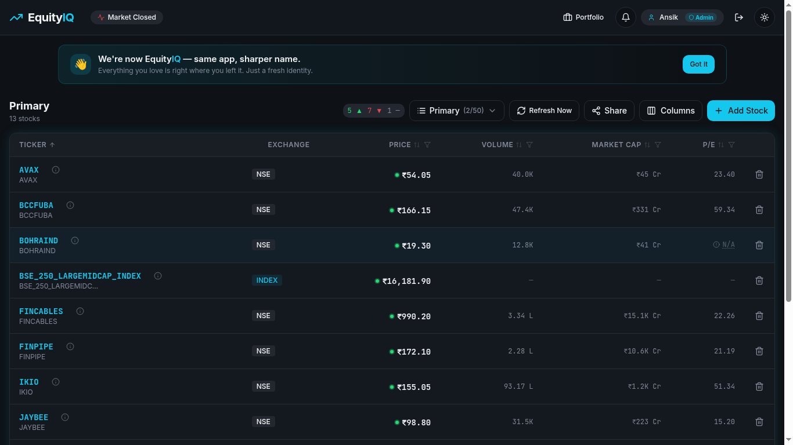
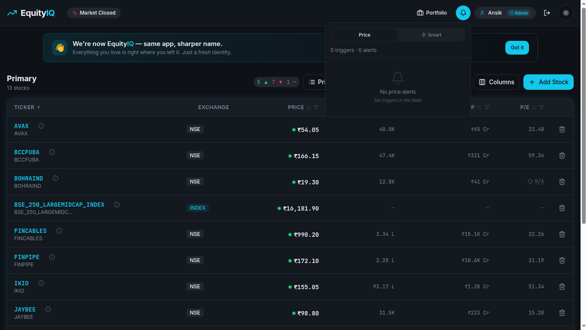
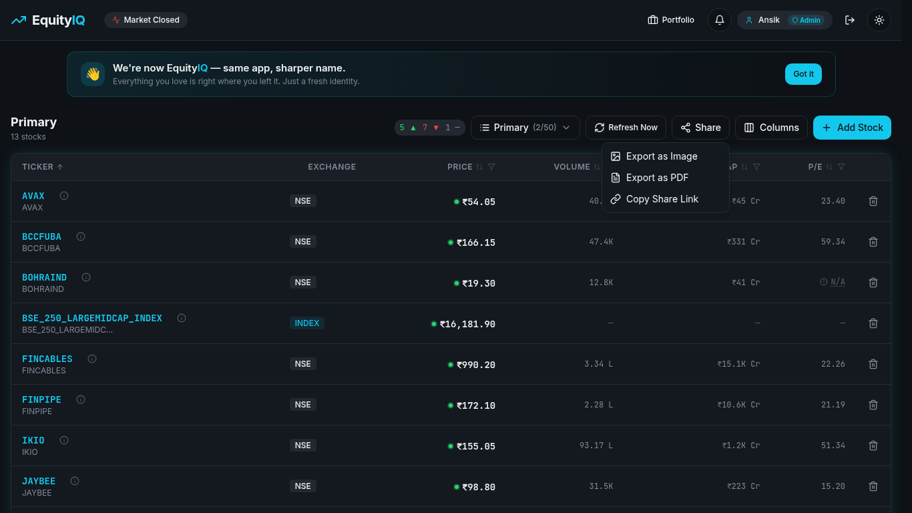
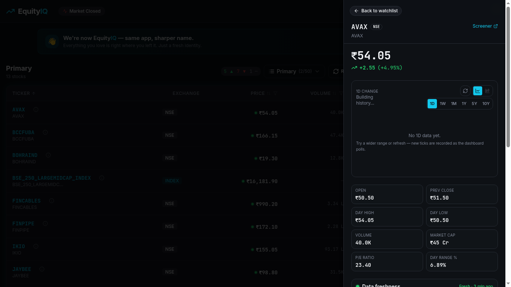

# EquityIQ — Stock Screener & Watchlist Platform

> A premium, real-time stock screening, watchlist, portfolio tracking, and alerts platform for **NSE & BSE** listed equities. Built for retail investors, traders, and analysts who want a fast, focused, and beautifully designed research workflow.

🌐 **Live App:** [https://www.equityiq.in](https://www.equityiq.in/)

---

## 📑 Table of Contents

- [Overview](#-overview)
- [Tech Stack](#-tech-stack)
- [Key Features](#-key-features)
- [Use Case Scenarios](#-use-case-scenarios)
- [Application Documentation](#-application-documentation)
- [API Documentation](#-api-documentation)
- [Local Development](#-local-development)
- [Deployment](#-deployment)
- [Security & Privacy](#-security--privacy)
- [Support](#-support)

---

## 🧭 Overview

EquityIQ helps Indian market participants:

- Track 5,000+ NSE & BSE listed stocks in real-time during market hours.
- Maintain multiple **watchlists** with custom tags, notes, and price triggers.
- Monitor a live **portfolio** with sector allocation, P&L, and charts.
- Get **Smart Alerts** for 52-week highs/lows, volume spikes, and anomalies.
- Export and share watchlists as PDF, image, or read-only links.
- Use the app as a **PWA** on mobile or as a desktop **Electron** app.

The app supports both **Guest Mode** (local-only) and **Authenticated Mode** (cloud-synced) workflows, with subscription tiers (Free / Premium / Premium Plus / Lifetime) gating advanced functionality.

---

## 🛠 Tech Stack

### Frontend
- **React 18** + **TypeScript 5** — UI layer
- **Vite 5** — build tool & dev server
- **Tailwind CSS v3** + **shadcn/ui** (Radix primitives) — design system
- **framer-motion** — animations
- **TanStack Query** — async/data fetching
- **React Router v6** — routing
- **Recharts** — charts and visualizations
- **Lucide React** — iconography
- **react-hook-form** + **Zod** — form handling and validation
- **html2canvas** + **jsPDF** — image and PDF exports

### Backend (Lovable Cloud / Supabase)
- **PostgreSQL** — primary datastore with **Row Level Security (RLS)**
- **Supabase Auth** — email + Google OAuth, email verification
- **Supabase Edge Functions** (Deno) — serverless compute
- **Supabase Realtime** — live subscriptions
- **Supabase Storage** — file/asset storage

### Integrations
- **Razorpay** — payment gateway for subscriptions (UPI, cards, net banking)
- **Resend** — transactional email delivery
- **Groww / Screener.in proxies** — stock data sources
- **Lovable AI Gateway** — for AI-driven features (no API key required)

### Cross-Platform
- **Capacitor** — Android packaging
- **Electron** — desktop builds
- **PWA** — installable mobile/desktop progressive web app

### Hosting
- **Vercel** — frontend hosting
- **Lovable Cloud** — backend, database, edge functions

---

## ✨ Key Features

- 📈 **Real-Time Stock Data** — Live prices during IST market hours (9:15–15:30) with dynamic polling intervals.
- 🗂 **Multiple Watchlists** — Organize stocks by theme, strategy, or sector.
- 🏷 **Tags & Notes** — Add custom labels and personal notes to any stock.
- 🔔 **Price Triggers** — Upper/lower price alerts delivered via email.
- 🚨 **Smart Alerts** — Auto-detected 52-week highs/lows and volume spikes (with deduping & cooldowns to avoid alert fatigue).
- 💼 **Portfolio Tracking** *(Premium)* — Buy price, quantity, real-time P&L, sector allocation charts.
- 📊 **Stock Detail Sheet** — Up to **10 years** of historical price data with scrollable charts (1D, 1W, 1M, 1Y, 5Y, 10Y).
- 📤 **Share & Export** — Read-only share links, PDF reports, PNG exports.
- 📧 **Email Notifications** — Daily summaries, price triggers, smart alert digests (with opt-in control & one-click unsubscribe).
- 🔐 **Encryption** — Watchlists, columns, and notes are encrypted before persistence.
- 🌗 **Dark Mode** — Premium glassmorphism UI with teal accent (`#148a9e`).
- 📱 **Mobile PWA** — Bottom navigation, mobile-optimized cards, installable.

---

## 🎯 Use Case Scenarios

> 🖼 The screenshots below illustrate the core surfaces referenced in each scenario. Click any image to view it full-size.

### 1. The Long-Term Investor
- Build a watchlist of 50–100 fundamentally strong stocks.
- Tag them by thesis: `Compounder`, `Dividend`, `Long-term Hold`.
- Use **10-year historical charts** to evaluate cyclical patterns.
- Track actual holdings via **Portfolio** to see lifetime P&L and sector mix.


*The main dashboard — a sortable, filterable watchlist with live prices, market cap, P/E, and per-row actions.*

### 2. The Active Swing Trader
- Maintain focused watchlists per setup: `Breakout Watch`, `Reversal`, `Earnings Soon`.
- Set **price triggers** at key support/resistance levels.
- Enable **Smart Alerts** for 52-week breakouts and volume spikes.
- Monitor real-time price movement during market hours.


*The Alerts panel surfaces Price triggers and Smart anomaly alerts in a single dropdown from the header bell.*

### 3. The Research Analyst
- Use **inline column customization** (Premium) to surface custom metrics.
- Export watchlists as **PDF reports** for client distribution.
- Generate **read-only share links** for collaborators.
- Cross-reference tickers with **Screener.in** via integrated external links.


*One-click export to Image, PDF, or a copyable read-only share link from the Share menu.*

### 4. The Casual Tracker / Beginner
- Start in **Guest Mode** — no signup needed; data stored locally and encrypted.
- Use the **interactive demo** to learn the workflow.
- Upgrade later by signing up; data carries over after authentication.


*The Stock Detail sheet shows live price, OHLC, market cap, P/E, day range, and a scrollable chart spanning 1D → 10Y.*

### 5. The Mobile-First User
- Install the **PWA** from the browser.
- Use the bottom navigation to flip between Watchlist, Portfolio, and Alerts.
- Receive **email alerts** even while away from the app.

### 6. The Premium Power User
- Unlock **Premium Plus**: up to **50 watchlists × 100 stocks each**.
- Get advanced exports, priority email queue, and full Smart Alert coverage.
- Use the **Admin Dashboard** (admin role only) to manage subscriptions and users.


---

## 📚 Application Documentation

### Routing

| Route | Purpose | Access |
|---|---|---|
| `/` | Landing page (marketing, pricing, demo) | Public |
| `/auth` | Sign in / sign up | Public |
| `/dashboard` | Main watchlist screener | Auth-guarded |
| `/portfolio` | Holdings & P&L tracker | Premium |
| `/profile` | Account, password, subscription | Auth-guarded |
| `/subscribe` | Razorpay checkout flow | Auth-guarded |
| `/admin` | Admin dashboard | Admin role |
| `/shared/:token` | Read-only watchlist view | Public |
| `/unsubscribe` | Email opt-out flow | Public |

### Authentication Flow

1. User signs up via email/password or Google OAuth.
2. **Email verification is mandatory** before dashboard access.
3. A **Check Now** button refreshes verification status without page reload.
4. New users get a **15-day trial** of Premium features.
5. After trial expiry, restricted features show upgrade prompts.

### Subscription Tiers

| Tier | Watchlists | Stocks/list | Smart Alerts | Portfolio | Exports |
|---|---|---|---|---|---|
| **Free** | 1 | 10 | ❌ | ❌ | Basic |
| **Premium** | 10 | 50 | ✅ | ✅ | PDF / PNG |
| **Premium Plus** | 50 | 100 | ✅ | ✅ | All formats |
| **Lifetime** | 50 | 100 | ✅ | ✅ | All formats |

Payments are processed by **Razorpay** (UPI, cards, net banking, wallets).

### Data Persistence Model

- **Stock prices** are upserted into `stock_price_history` only during IST market hours.
- Historical points are pruned beyond **10 years**, enabling long-range charts.
- **Watchlists, tags, notes, columns** are encrypted client-side before storage.
- **Realtime subscriptions** keep watchlists in sync across tabs/devices.

### Email System

- Transactional: signup, magic link, recovery, email change, welcome.
- Digests: price-trigger digest, smart-alert digest, daily summary.
- All templates use a **dark-themed React Email layout**.
- Every email includes a **one-click unsubscribe** link.

---

## 🔌 API Documentation

The backend exposes **Supabase Edge Functions** (Deno runtime) under:

```
https://<project-ref>.supabase.co/functions/v1/<function-name>
```

All functions accept `POST` requests with `Content-Type: application/json` unless stated otherwise. Authenticated functions require a Supabase JWT in the `Authorization: Bearer <token>` header.

### Public Endpoints (no JWT required)

#### `POST /stock-proxy`
Fetches live or recent stock quote data from upstream providers.
```json
// Request
{ "ticker": "RELIANCE", "exchange": "NSE" }

// Response
{ "ticker": "RELIANCE", "price": 2945.5, "change": 32.1, "changePercent": 1.10, "high": 2960, "low": 2910, "volume": 12400000 }
```

#### `POST /groww-proxy`
Alternative data source proxy for Groww-backed quotes.

#### `POST /screener-search`
Searches the NSE/BSE universe by ticker or company name.
```json
// Request
{ "query": "tata" }

// Response
{ "results": [{ "ticker": "TATAMOTORS", "name": "Tata Motors Ltd", "exchange": "NSE" }, ...] }
```

#### `POST /upsert-stock-prices`
Appends current ticks into `stock_price_history` (gated to IST market hours). Prunes data older than 10 years.

#### `POST /get-shared-watchlist`
Returns a read-only watchlist by share token.
```json
// Request
{ "token": "abc123xyz" }

// Response
{ "watchlist": { "name": "...", "stocks": [...] }, "owner": "..." }
```

#### `POST /handle-email-unsubscribe`
Disables email notifications for a user via signed token.

#### `POST /razorpay-create-order`
Creates a Razorpay order for subscription checkout.
```json
// Request
{ "plan": "premium_plus", "billing": "yearly" }

// Response
{ "orderId": "order_XYZ", "amount": 99900, "currency": "INR", "keyId": "rzp_..." }
```

#### `POST /razorpay-verify-payment`
Verifies the Razorpay payment signature and activates the subscription.

#### `POST /send-transactional-email`
Sends a templated email (signup, recovery, welcome, etc.).

#### `POST /auth-email-hook`
Webhook invoked by Supabase Auth for email-related events.

### Authenticated Endpoints (JWT required)

#### `POST /process-email-queue`
Processes pending email queue entries (price trigger digests, smart alerts).

#### `POST /admin-users` *(admin role required)*
Lists, updates, or overrides user subscriptions.
```json
// Request
{ "action": "list" | "update" | "override_plan", "userId": "uuid", "plan": "lifetime" }
```

### Database Tables (high level)

| Table | Purpose |
|---|---|
| `profiles` | User profile data |
| `user_roles` | RBAC (user, moderator, admin) |
| `subscriptions` | Active plan, expiry, Razorpay refs |
| `watchlists` | Encrypted watchlist payloads |
| `portfolio_holdings` | Buy price, quantity, ticker |
| `stock_price_history` | Tick-level history (10y retention) |
| `price_alerts` | Per-stock upper/lower triggers |
| `smart_alerts` | Auto-detected anomalies with dedupe state |
| `email_queue` | Pending transactional/digest emails |
| `app_reviews` | In-app user reviews |

> **RLS** is enforced on every table. Roles are checked via a `SECURITY DEFINER` function (`has_role`) to prevent recursion.

---

## 💻 Local Development

**Prerequisites:** Node.js 18+ and npm (install via [nvm](https://github.com/nvm-sh/nvm)).

```sh
# 1. Clone the repository
git clone <YOUR_GIT_URL>
cd <YOUR_PROJECT_NAME>

# 2. Install dependencies
npm install

# 3. Start the dev server
npm run dev
```

The app will be available at `http://localhost:8080`. Backend (Supabase) runs in the cloud — no local DB needed.

### Useful Scripts

| Command | Description |
|---|---|
| `npm run dev` | Start Vite dev server |
| `npm run build` | Production build |
| `npm run build:dev` | Development-mode build |
| `npm run preview` | Preview production build |
| `npm run lint` | Run ESLint |
| `npm run test` | Run Vitest test suite |
| `npm run test:watch` | Vitest watch mode |

---

## 🚢 Deployment

- **Web (Vercel):** Push to `main` — Vercel auto-deploys.
- **Backend (Lovable Cloud):** Edge functions deploy automatically on save; migrations apply via the migration tool.
- **Android (Capacitor):** `npx cap sync android && npx cap open android`.
- **Desktop (Electron):** Run via `electron/main.cjs`.

---

## 🔒 Security & Privacy

- All user-specific data (watchlists, columns, notes) is **encrypted client-side** before being persisted.
- Authentication uses Supabase Auth with mandatory **email verification**.
- All database tables enforce **Row Level Security (RLS)**.
- Roles are stored in a separate `user_roles` table and validated via `SECURITY DEFINER` functions to prevent privilege escalation.
- Payments are handled by **Razorpay** — no card data ever touches our servers.
- Emails support **one-click unsubscribe** in compliance with anti-spam best practices.

---

## 🆘 Support

- 🌐 **Live App:** [https://equityiq.vercel.app/](https://equityiq.vercel.app/)
- 📧 **Email:** Use the in-app contact form on the Profile page.
- 📝 **Reviews:** Submit feedback via the in-app review prompts.

---

_Built with ❤️ using [Lovable](https://lovable.dev), React, TypeScript, Tailwind CSS, and Lovable Cloud (Supabase)._
